# Phase 1 Multimodal Physiology Pipeline

This project turns the archived Empatica E4 signals and videos into a modular, notebook-debuggable ML pipeline for heart-rate, cardiovascular-load, and BP-proxy modeling.

## Environment

Python 3.11 is recommended for package compatibility.

This workspace has already been set up with a Conda-backed Python 3.11 environment at `.venv`.

```powershell
conda activate C:\Users\HP\Downloads\phase_1\.venv
python -m pip install -r requirements.txt
python -m ipykernel install --prefix .\.venv --name phase_1 --display-name "Python (phase_1)"
```

The default Anaconda Python on this machine is 3.13.9, so use `.venv` for the notebooks and pipeline.

## Workflow

Run notebooks in order:

1. `notebooks/01_archive_inspection.ipynb`
2. `notebooks/02_data_alignment.ipynb`
3. `notebooks/03_video_rppg_extraction.ipynb`
4. `notebooks/04_feature_engineering.ipynb`
5. `notebooks/05_ml_models.ipynb`
6. `notebooks/06_deep_learning_pipeline.ipynb`
7. `notebooks/07_video_branch_debug.ipynb`
8. `notebooks/08_ml_prediction.ipynb`
9. `notebooks/09_dl_prediction.ipynb`

Reusable implementation code lives under `src/`. The old `ai-blood-preassure.ipynb` is preserved as a legacy prototype.

## Generated Outputs

- `outputs/aligned/`: one 1 Hz aligned CSV per trial.
- `outputs/features/trial_features.csv`: trial-level feature and pseudo-target table.
- `outputs/features/dl_windows.csv`: supervised aligned windows for deep learning.
- `outputs/models/`: first-pass HR, cardiovascular-load, and BP-proxy model artifacts.
- `outputs/predictions/`: random held-out prediction CSVs for ML and DL models.

## Client Visual Analytics Package

This repository now includes a client-friendly visual reporting layer under `reports/`. It translates the saved technical outputs into business-facing figures that explain what was analyzed, which models performed best, where the video signal is reliable, and how the workflow creates practical value. The package uses only existing CSV, JSON, image, and video assets; no models were retrained and no experiments were rerun.

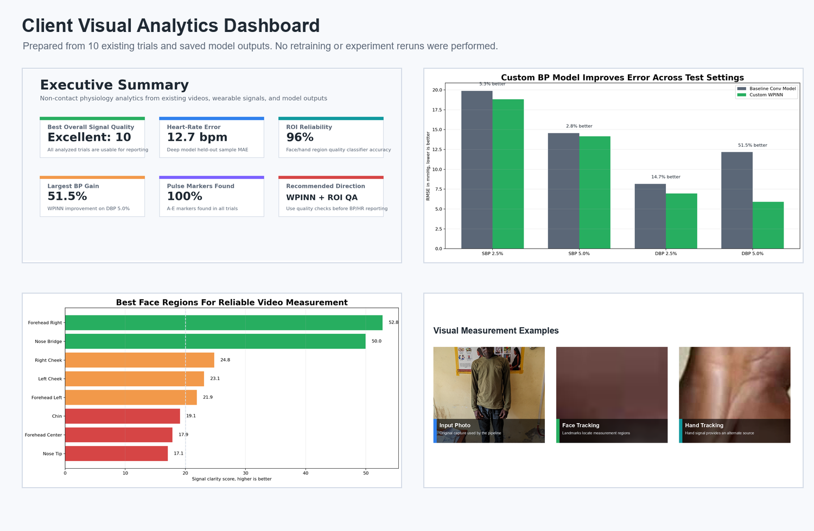

### Project Overview

The project estimates physiology signals from wearable measurements and video. In plain terms, it checks whether a person can be measured reliably from available recordings, extracts pulse-related signals, compares model outputs, and presents the most useful results for decision-makers.

The business objective is to make non-contact physiology reporting easier to review: clients should be able to see whether the data is usable, which model direction is strongest, and what operational checks are needed before relying on results.

### Executive Summary

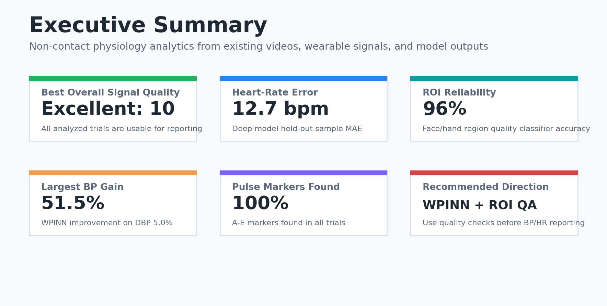

Key takeaways from the saved results:

- All 10 analyzed trials were classified as excellent quality in the saved signal-quality summary.
- The deep multimodal model produced a held-out heart-rate error of about 12.7 bpm on the saved sample predictions.
- The custom WPINN blood-pressure model showed its largest saved improvement on DBP 5.0%, reducing RMSE by 51.5% versus the baseline model.
- Face and hand region quality checks reached 96% accuracy in the saved real-data quality classifier summary.
- Recommended direction: use ROI quality screening plus the custom BP model for the clearest client-facing workflow.

### Model Comparison

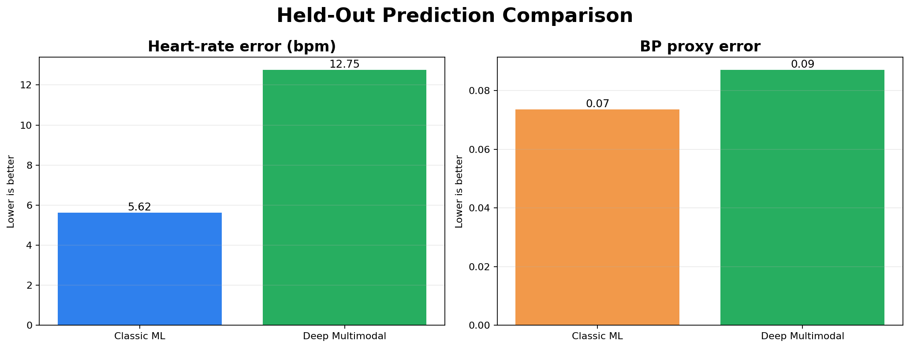

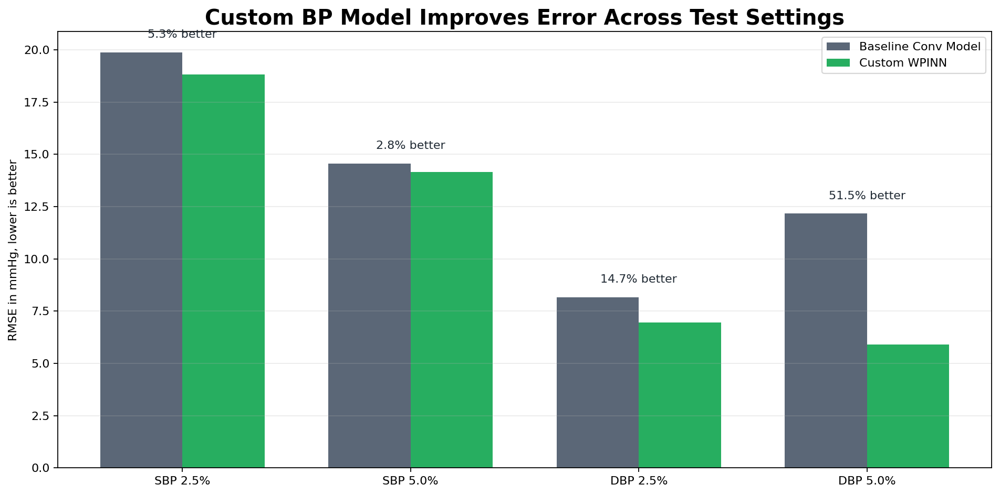

The comparison visuals focus on plain-language outcomes: lower error, clearer signal, and better operational reliability. The WPINN chart highlights where the custom model improves over the baseline BP model across saved SBP and DBP test settings.

### Pretrained And Custom Model Analysis

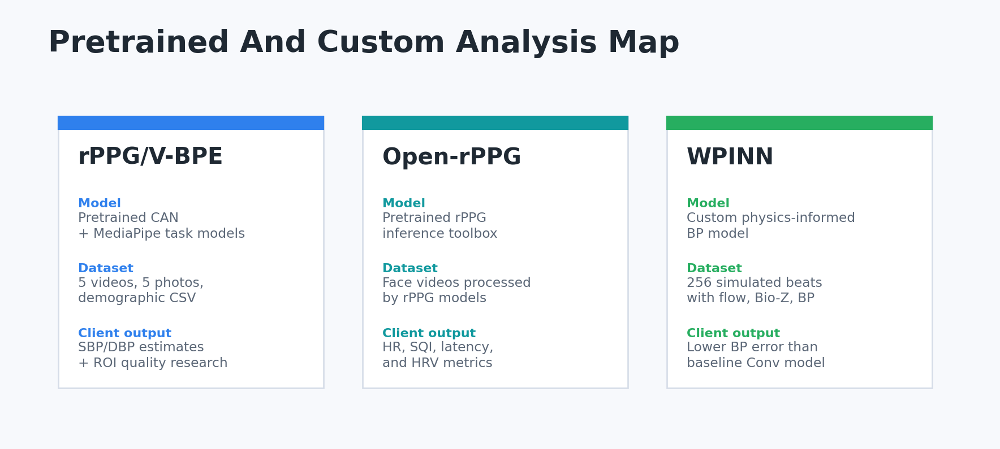

The project contains three related analysis tracks:

- `rppg_inference_vbpe/` uses pretrained CAN weights (`can2d_pytorch.pth`) plus MediaPipe face, hand, and pose task models. Its dataset is 5 local subject videos, 5 matching full-body photos, and `Input_Data/Demographic_Data.csv`. It produces face/hand tracking videos, PPG CSVs, and final SBP/DBP estimates.
- `open_rppg_inference/` is a pretrained rPPG toolbox track. Its report shows heart-rate, signal-quality, latency, and HRV-style outputs from face-video inference.
- `wpin_analysis/WPINN/` uses a custom Windkessel physics-informed model. Its dataset is simulated HaeMod beat data with 256 beats, 64 timesteps, aortic flow, time, Bio-Z, and BP waveform targets.

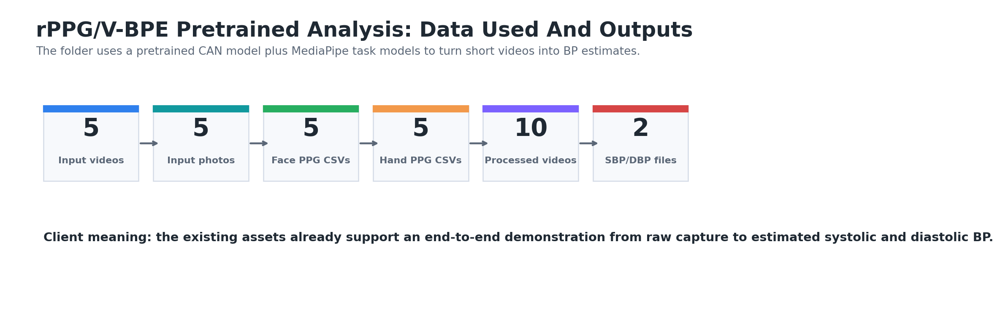

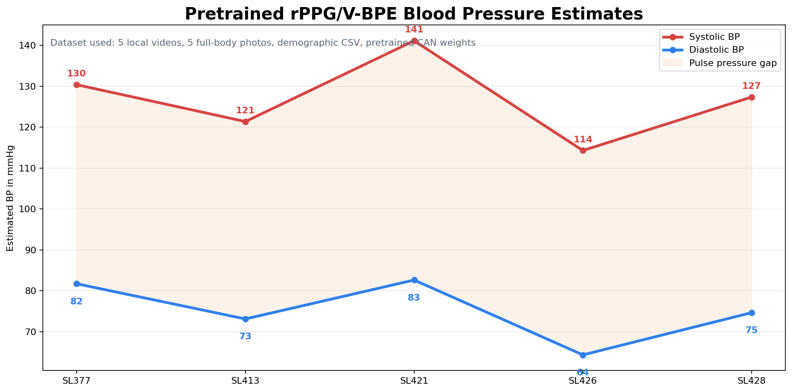

For the pretrained V-BPE run, the saved estimates are:

| Subject | SBP | DBP | Client meaning |
|---|---:|---:|---|
| SL377 | 130 | 82 | Higher pressure estimate |
| SL413 | 121 | 73 | Mid-range estimate |
| SL421 | 141 | 83 | Highest pressure estimate in the saved run |
| SL426 | 114 | 64 | Lowest pressure estimate in the saved run |
| SL428 | 127 | 75 | Mid-range estimate |

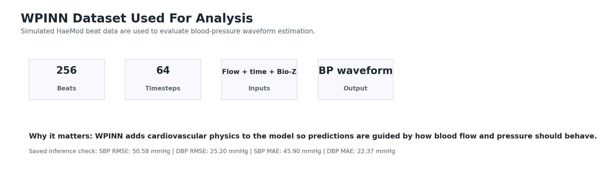

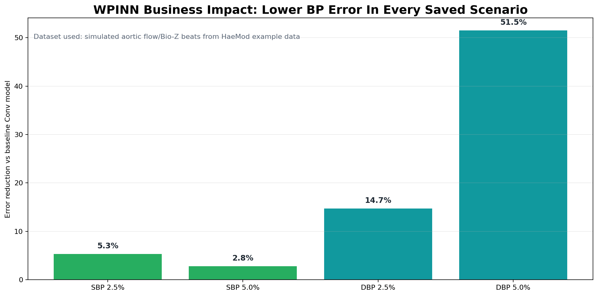

For the WPINN analysis, the saved model comparison shows the physics-informed model improves over the baseline Conv model in every saved scenario. The clearest gain is DBP at the 5.0% split, where RMSE improves by 51.5%.

### ROI Marking And Image-Backed Results

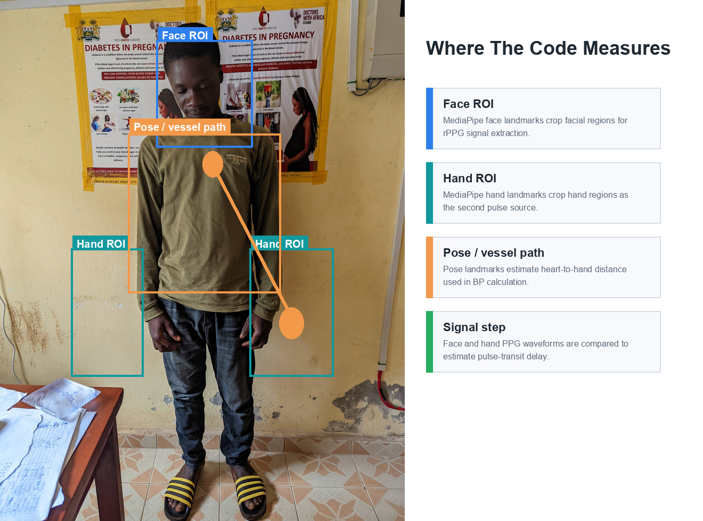

The subject overlay shows the practical measurement story used by the codebase:

- face regions are used to extract a remote pulse signal,
- hand regions provide a second pulse signal,
- pose landmarks estimate the heart-to-hand path used in the BP calculation,
- face and hand waveforms are compared to estimate pulse-transit delay.

The boxes are visual guide overlays for client communication. The actual code uses MediaPipe landmarks and frame-level crops rather than these fixed rectangles.

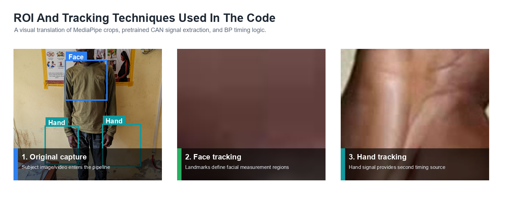

The technique panel shows the three most understandable stages: original subject capture, face tracking output, and hand tracking output.

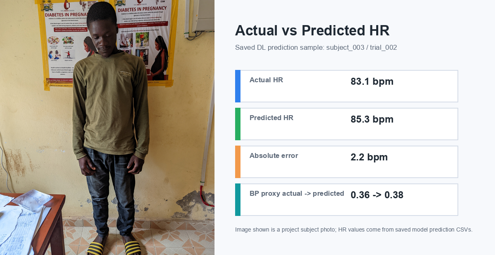

This card pairs a project subject image with the saved deep-learning HR prediction example. The HR values come from `outputs/predictions/dl_random_sample_predictions.csv`.

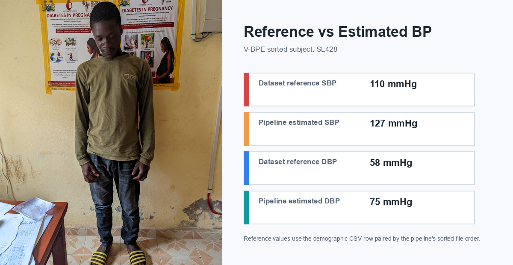

This card pairs a subject photo with reference BP values from `rppg_inference_vbpe/Input_Data/Demographic_Data.csv` and estimated BP values from `rppg_inference_vbpe/SBP_new.csv` and `rppg_inference_vbpe/DBP_new.csv`, using the same sorted file order used by the BP scripts.

### Custom Model Result Labels

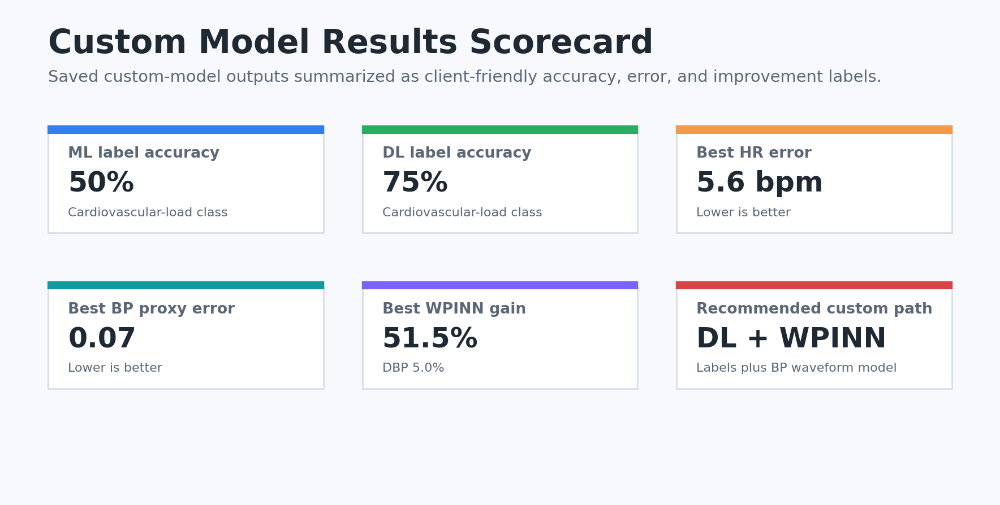

The custom model visuals separate two kinds of model quality:

- label accuracy for cardiovascular-load classes, where the model predicts a category such as low, moderate, or high load,
- regression error for HR, BP proxy, and WPINN BP estimates, where lower error is better than higher accuracy wording.

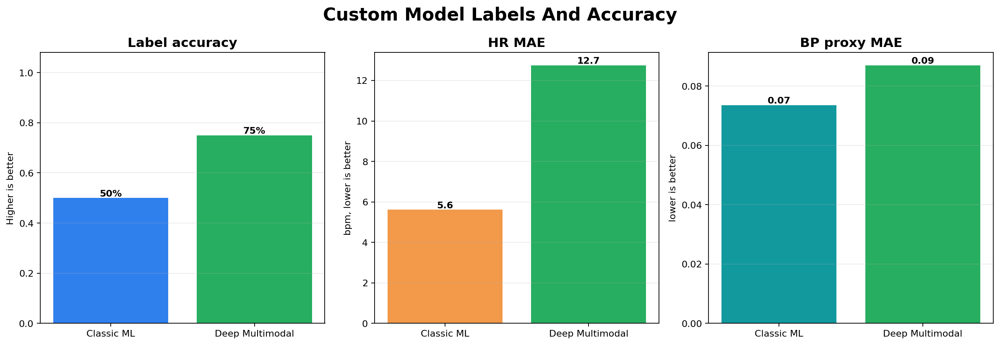

The saved sample outputs show classic ML label accuracy of 50% and deep multimodal label accuracy of 75% for cardiovascular-load class. The classic ML sample has lower HR and BP-proxy error in the saved rows, while the deep model provides stronger saved label accuracy.

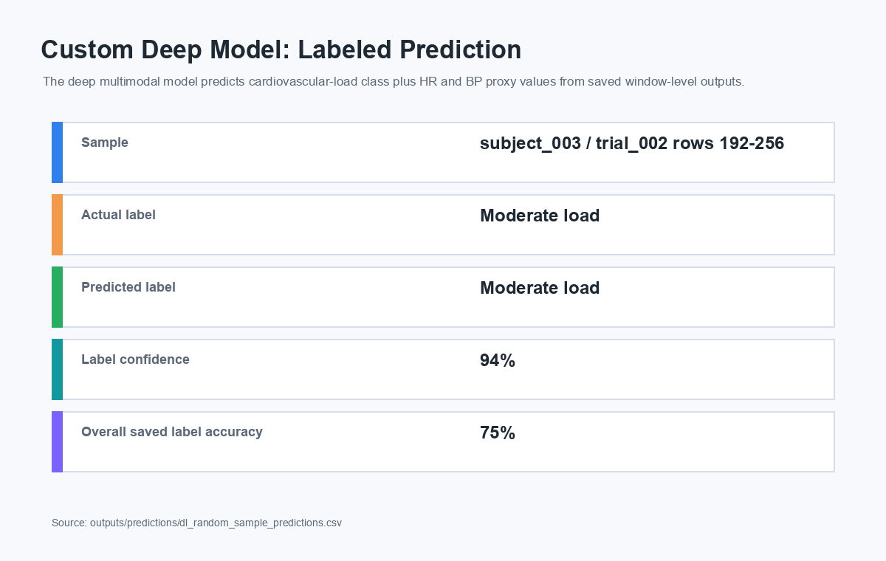

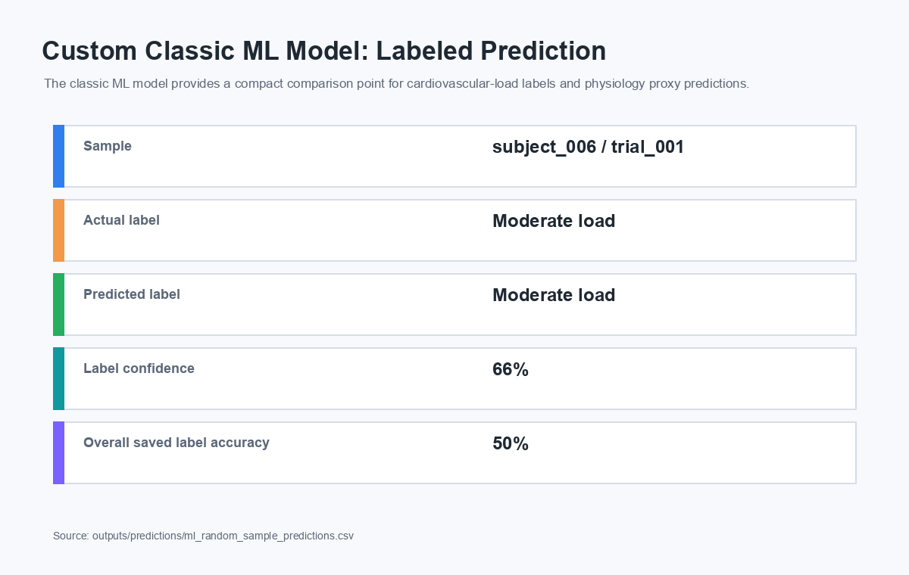

These cards show actual label, predicted label, confidence, and overall saved label accuracy for representative custom model predictions.

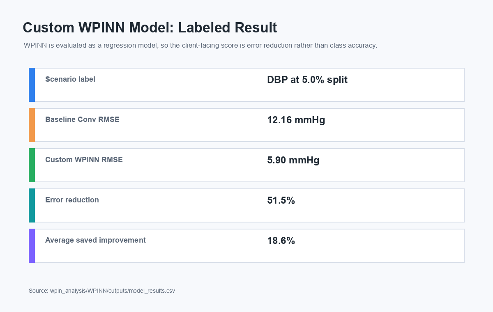

WPINN is a custom regression model, so its client-facing result is not class accuracy. Its label is the test scenario, and its success metric is lower RMSE. The strongest saved result is DBP at the 5.0% split, where WPINN reduces RMSE from 12.16 mmHg to 5.90 mmHg, a 51.5% improvement.

### Success Cases

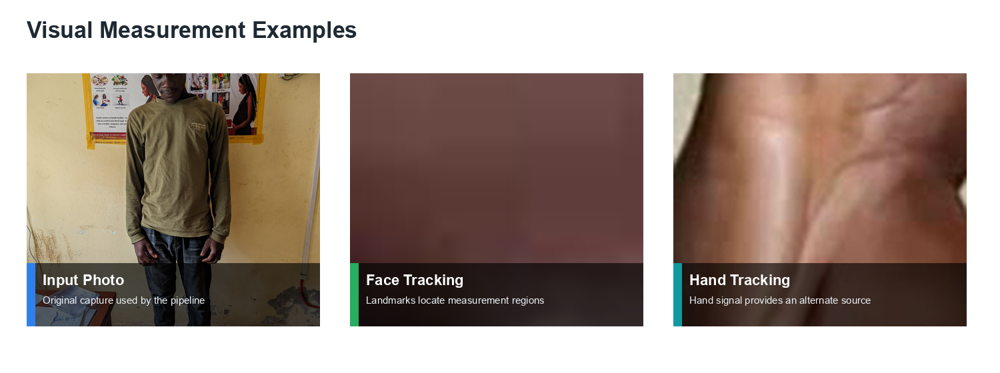

These examples use actual project photos and processed videos to show the measurement story: start with a normal capture, identify face or hand regions, then use those regions as inputs for signal analysis.

### Failure And Challenge Analysis

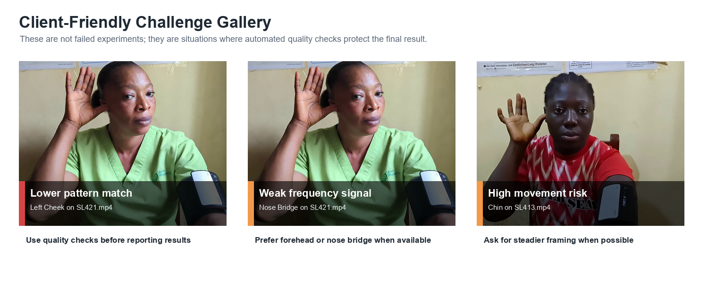

The challenge gallery explains weaker cases in client language. It frames them as quality-control situations: lower pattern match, weak frequency signal, or movement risk. The practical takeaway is that automated quality checks should protect the final report from unreliable frames or regions.

### Workflow Visual

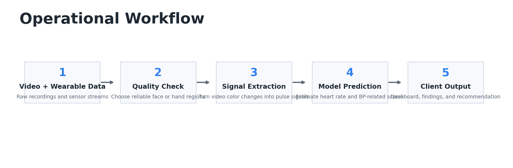

The workflow is organized for implementation and review:

1. Collect video and wearable data.
2. Check whether the visible region is reliable.
3. Extract pulse-related signals.
4. Run saved model predictions.
5. Present final dashboards, findings, and recommendations.

### Report Assets

Generated client-facing outputs are organized as:

```text
reports/
├── executive_summary/
├── model_comparisons/
├── success_cases/
├── failure_cases/
├── workflow_visuals/
├── presentation_assets/
└── dashboard_visuals/
```

Supporting files:

- `reports/presentation_assets/ASSET_INVENTORY.md`: inventory of existing charts, metrics, visual assets, videos, and documentation.
- `reports/executive_summary/KEY_FINDINGS.md`: short client-facing findings summary.
- `reports/VISUALIZATION_CHANGELOG.md`: files created, files modified, visualization purposes, data sources, and pending enhancements.

To regenerate the visual analytics package:

```powershell
E:\phase_1\.venv\python.exe generate_client_visuals.py
```

## Deep Learning Notes

The DL model follows the planned multi-branch design:

- video ROI/frame clip branch: 3D CNN,
- BVP branch: 1D CNN,
- EDA/TEMP/ACC/IBI branch: temporal CNN,
- engineered feature branch: MLP,
- temporal fusion: dilated CNN,
- heads: HR regression, cardiovascular-load classification, BP-proxy regression.

The installed MediaPipe package exposes a newer API layout, so video ROI loading tries MediaPipe FaceMesh first and falls back to OpenCV face cropping when FaceMesh is unavailable.

DL training standardizes static engineered features and regression targets. Prediction notebooks inverse-transform HR and BP-proxy outputs back to their original reporting scales, while also saving `predicted_*_model_scale` columns for debugging the model's internal normalized outputs.
